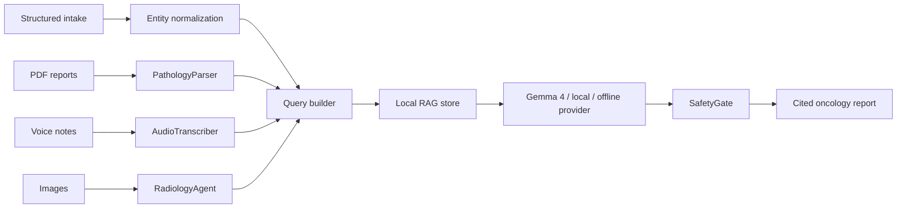

# Offline Multimodal Oncology Decision Support Using Quantized Frontier Models

## Abstract

Low-resource oncology settings need decision-support systems that can operate under privacy, connectivity, and hardware constraints while remaining auditable. We present OncoBoard-Edge, an offline-first multimodal oncology assistant that combines structured patient intake, PDF pathology extraction, voice-note transcription, image artifact handling, local evidence retrieval, and grounded report generation. The system enforces retrieval before reasoning and validates citations through a safety gate. It supports hosted Gemma 4, local Ollama-compatible inference, and a deterministic offline fallback for reproducible demonstrations. Initial benchmarks show that the complete Phase 1 pipeline can run locally with explainable evidence references and structured confidence reporting.

## Introduction

Cancer care often depends on multidisciplinary interpretation of pathology, imaging, biomarkers, patient fitness, and evolving guideline evidence. In many environments, especially low-resource or bandwidth-constrained centers, cloud-only systems are impractical. OncoBoard-Edge is designed around the principle that oncology reasoning must be evidence-grounded, auditable, and stable even when external model services are unavailable.

## Methodology

The system uses a deterministic graph with the following nodes:

1. Patient intake normalization.
2. Pathology PDF parsing with entity and provenance extraction.
3. Audio transcript ingestion with optional Whisper transcription.
4. Radiology artifact registration and sidecar summary handling.
5. Local evidence retrieval from ChromaDB or a keyword fallback corpus.
6. Gemma-compatible report generation.
7. Safety validation for citation grounding.

The RAG layer stores document chunks with `doc_id`, `chunk_id`, `source_title`, `section`, `page`, score, and source type. Retrieval queries combine the clinician question with tumor site, diagnosis, histology, stage, symptoms, and biomarker entities.

## Architecture

## Evaluation

The benchmark suite measures:

- End-to-end latency.
- Retrieval grounding against expected chunk IDs.
- Report confidence and citation coverage.
- Structural report validity.

Generated figures:

- `paper/figures/latency_benchmark.svg`
- `paper/figures/grounding_matrix.svg`
- `paper/figures/benchmark_table.csv`

## Limitations

OncoBoard-Edge is not a medical device. The current image path is Phase 1 artifact handling and does not perform diagnostic image interpretation. The offline provider produces deterministic, evidence-backed reports for stability and is not a substitute for a validated clinical LLM. Real deployments require approved guideline corpora, clinician review, PHI governance, and local regulatory validation.

## Future Work

Future work includes DICOM support, medical image embeddings, stronger biomedical reranking, claim-level citation alignment, calibrated uncertainty, local quantized Gemma serving recipes, larger expert-labeled evaluations, and prospective tumor-board usability studies.
